# AWS Secure VPC Bastion Host Project

##  Overview
secure AWS network architecture using Amazon VPC with public and private subnets.  
bastion host is used as a secure entry point to access a private EC2 instance.

AWS არქიტექტურა Amazon VPC-ს გამოყენებით საჯარო და დახურული საბნეტებისთვის. 
Bastion host გამოყენება როგორც უსაფრთხო შესასვლელი private EC2 instance-ზე

---

##  Architecture Design
მოიცავს შემდეგს:

custom VPC (secure-vpc)
public subnet (Bastion Host)
private subnet (Application Server)
internet gateway (IGW)
route tables for public and private subnets
security Groups for controlled access

---

##  Security 
უსაფრთხოების / SG გამოყენება

private EC2 instance has no direct public access
bastion host is the only entry point from the internet
SSH access to private subnet is allowed only from Bastion
security groups restrict unnecessary traffic

---

##  AWS Services 
გამოყენებული სერვისები

Amazon VPC
Amazon EC2
security groups
internet gateway
route tables
SSH (Secure Shell)

---

##  Connectivity 
დაკავშირების პრინციპი

1. user connects to Bastion Host via SSH
2. bastion Host connects to Private EC2 instance
3. private instance is not directly accessible from the internet

---

## Screenshots
სცრინები

### VPC
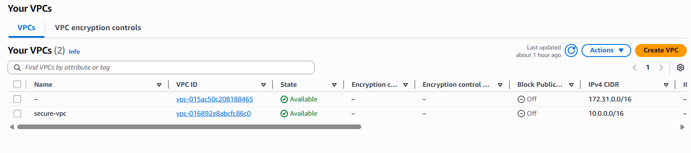
---

### Public Subnet
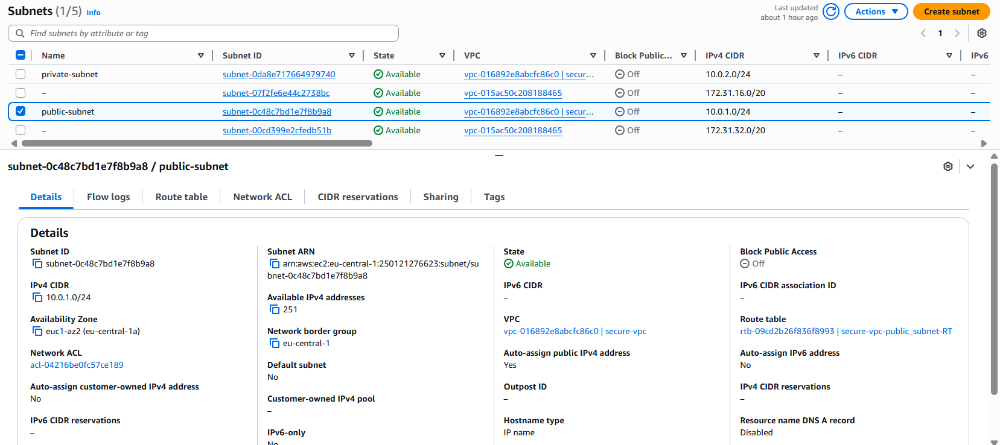
---

### Private Subnet
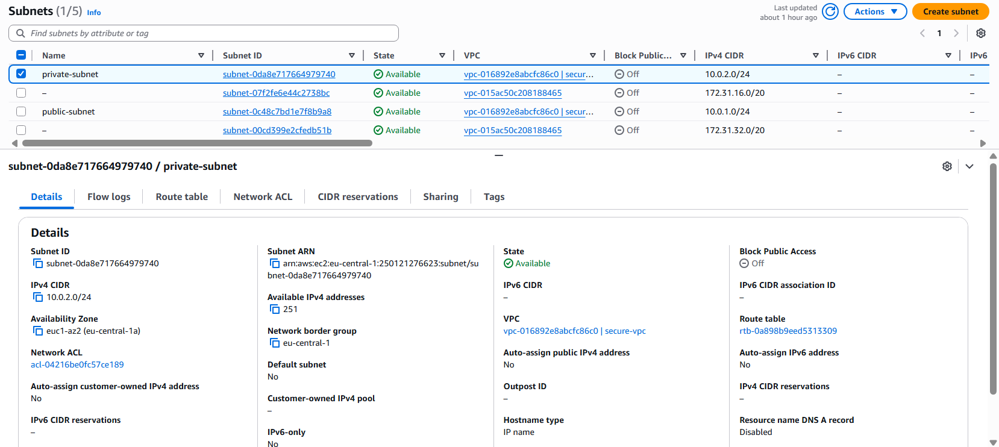
---

### Internet Gateway
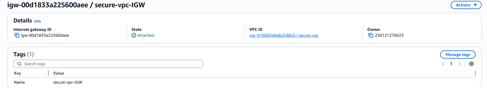
---

### Route Tables

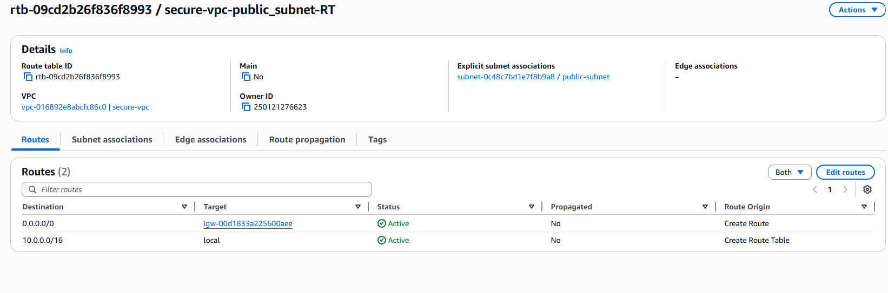
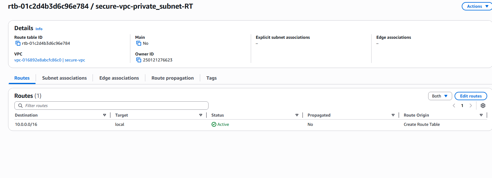
---

### Security Groups
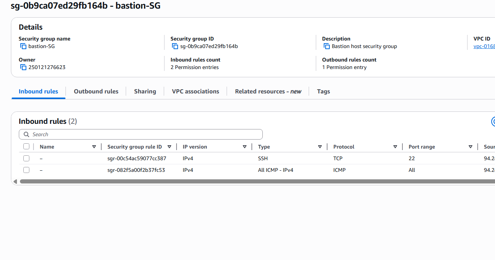
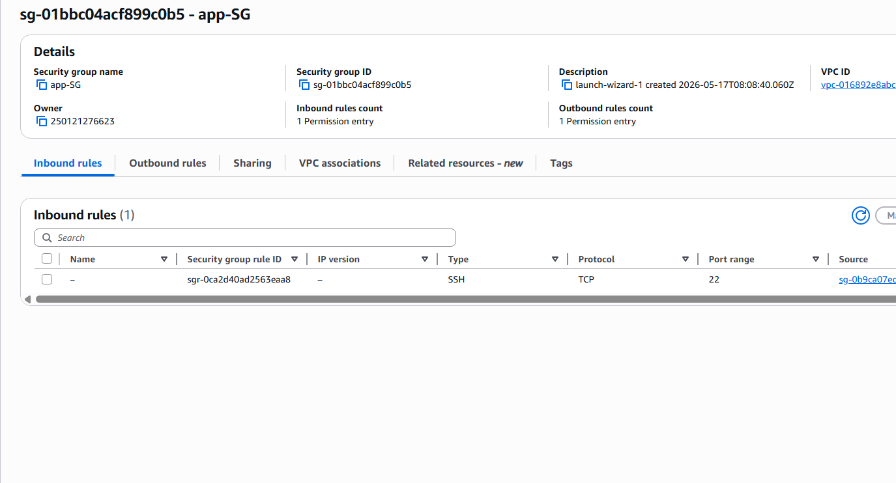

---

### EC2 Instances
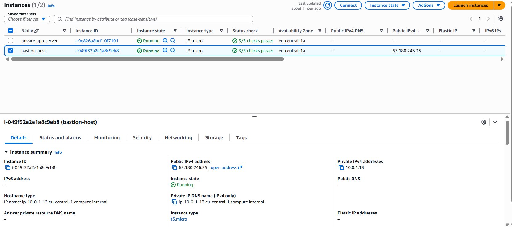
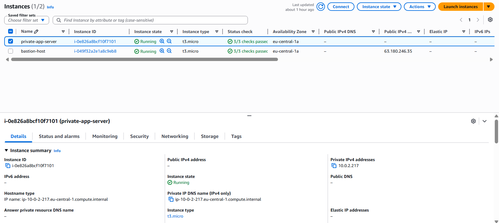
---

### Bastion to Private Connection
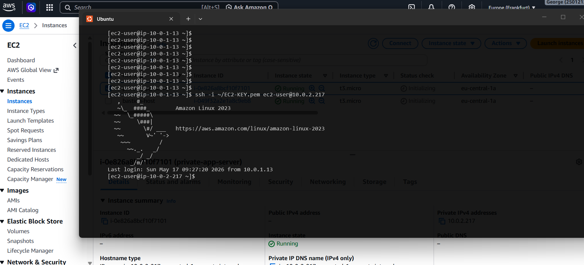
---

##  Author
Giorgi Petriashvili
გიორგი პეტრიაშვილი

Network Engineer (NOC Experience)  
Building Cloud skills with AWS (VPC, EC2, IAM, S3, CloudWatch)  
Preparing for AWS Certified Solutions Architect certification
